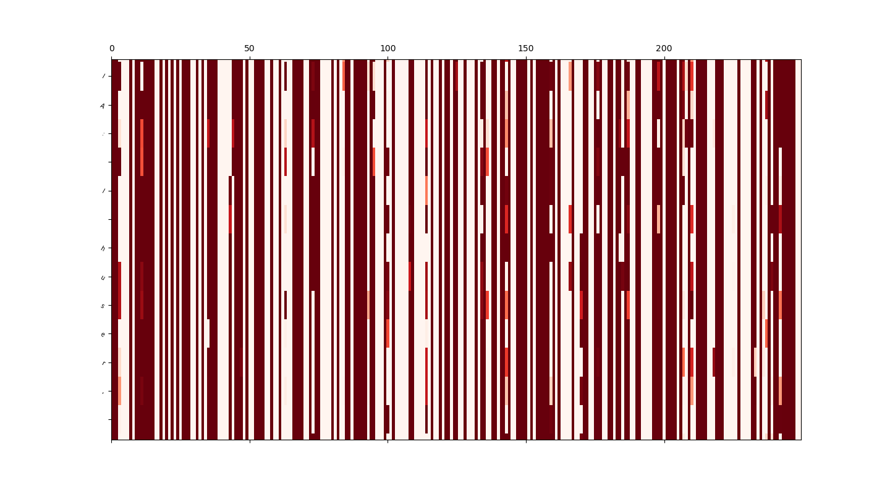

# rnn-char
RNN character level

Some text generated with the provided weights
starter string was from a Shakespeare text 
<i>"First Citizen:\nLet us kill him, and we'll have corn at our own price.\nIs't a verdict?"</i>

```
oe seee he attete have gear, of seed have to lith the must the whise ky be you.

VOLUMNIA:
The with with my hasple, baturink alouse! be have he be do my deets hous so cansur of hearing pare pree the reil havour an begaen you to to go toke a to have the was you the sice, I the vaid beavon!

VOLUMNIA:
And than a the to heart, be so deap the you, an now now beath deast for the may
The you alouse they son
And and prepe.

SICINIUS:
What to be the of not the in deathes my deakn Ede not than me to have sweat.

VOLUMNIA:
Hath chile bace be let is so have wister for so so you shald seel so no shele the the and hath for my all a gurse as the that gonan one no amming this than he mour he seevon, the the the the the what come the he, hear: my sweat dead the the when you have the town he prosh of be his with say a kne to that shall than now the fellow?

----- 
```

### Some interesting things to note:

The RNN remembers characters. We can see that Volumnia responds after Sicinius. The model also has learnt to end the sentences with periods, exclamation or question marks. It also uss commas and colons quite well. However the model is not trained welll enough to generate good english text. 

## Visualizing neuron firing




