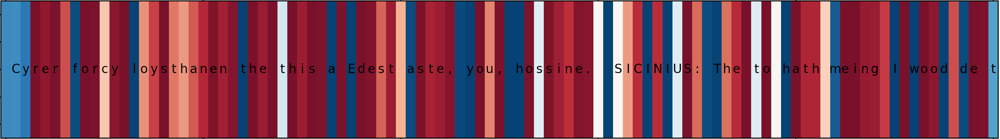
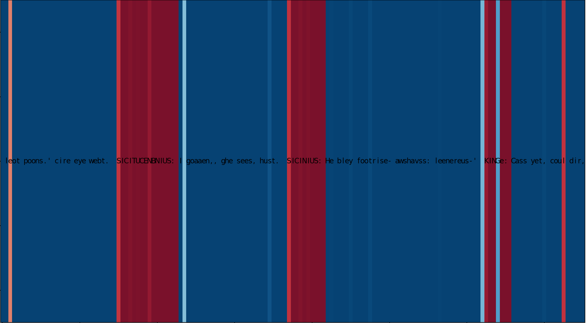
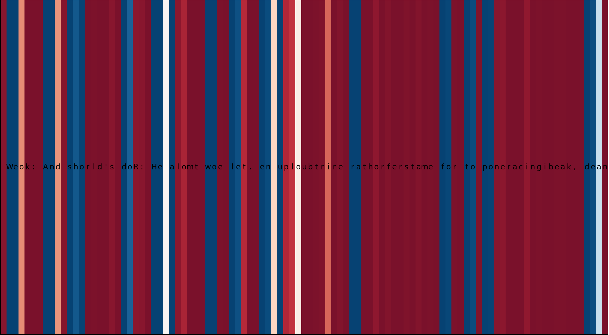

# RNN character level

## Overview

This is a character level RNN model using the implementation by Andrej Karpathy [article](http://karpathy.github.io/2015/05/21/rnn-effectiveness/). The works done here are inspired by the [assignment](http://www.cs.toronto.edu/~guerzhoy/tmp/understand-rnn/handout/index.html) at University of Toronto.

Some text generated with the provided weights is shown below-
the starter string used was from a Shakespeare text 
*"First Citizen:\nLet us kill him, and we'll have corn at our own price.\nIs't a verdict?"*

```
oe seee he attete have gear, of seed have to lith the must the whise ky be you.

VOLUMNIA:
The with with my hasple, baturink alouse! be have he be do my deets hous so cansur of hearing pare pree the reil havour an begaen you to to go toke a to have the was you the sice, I the vaid beavon!

VOLUMNIA:
And than a the to heart, be so deap the you, an now now beath deast for the may
The you alouse they son
And and prepe.

SICINIUS:
What to be the of not the in deathes my deakn Ede not than me to have sweat.

VOLUMNIA:
Hath chile bace be let is so have wister for so so you shald seel so no shele the the and hath for my all a gurse as the that gonan one no amming this than he mour he seevon, the the the the the what come the he, hear: my sweat dead the the when you have the town he prosh of be his with say a kne to that shall than now the fellow?

----- 
```
### Some interesting things to note:

The RNN remembers characters. We can see that Volumnia responds after Sicinius. The model also has learnt to end the sentences with periods, exclamation or question marks. It also uses commas and colons quite well. However the model is not trained welll enough to generate proper sentence structures. 

## Code
`shakespeare.py` will generate a sample text and also present a visualization of the neurons firing. 
`min-char-rnn.py` is the implementation by Andrej Karpathy of a 100 line character level RNN. 


## Visualizing neuron firing

Below is the complete visualization of all neurons for 150 characters. There are 250 neurons where each neuron is depicted by a column.


Few interesting neurons that track specific characteristics are shown below. The following visualizations depict the output of the `tanh` activation where Blue is -1 and Red is +1.


The above image shows a specific neuron that is firing at the start of each word. 



This neuron is shown to fire when a name has encountered. Secifically, it was noted that this neuron is attentive to names in block capitals, usually to show the character and their lines.



This neuron also seems to be activated when it is inside a word. 


